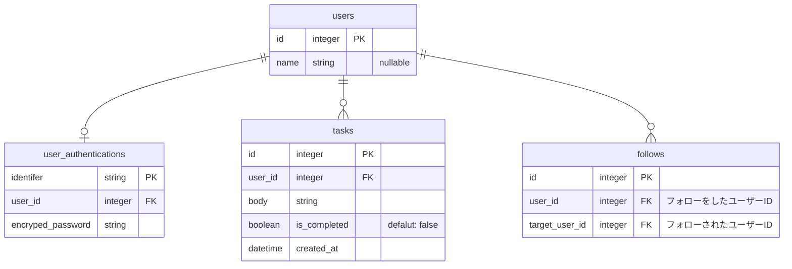

# インターン生入社前課題

本課題に取り組み、社員チェックが通れば実務に入ることができます。

# 目的

- 自己解決力を鍛える
- Web / Web アプリケーション開発の基礎を学ぶ

## 🌀 課題
タスク管理&共有アプリケーションを作成する。

目標期間：２ヶ月以内

## 🌱 必須要件

### ログイン機能

1. サインイン/サインアップすることができる。
    1. パスワードは、ハッシュ化してDBに保存
1. 画面をリロードしてもログインを維持する
2. ログイン時は新規登録・ログインページに遷移できない
3. 未ログイン時はトップページ・新規登録・ログインページ以外に遷移できない

### タスク機能

1. 新しい自分のタスクを作成することができる。
2. 自分のタスクを一覧表示することができる。
3. 自分のタスクを完了することができる。(他人のタスクは完了できない)
4. みんなのタスクを一覧表示することができる。

### フォロー機能

1. 他ユーザーをフォロー/フォロー解除することができる。
    1. フォローしたユーザーのタスクを一覧表示することができる。

### ファイト（いいね）機能

1. タスクに対してファイト/ファイト解除することができる
    1. 自分がファイトしたタスクを一覧表示することができる
2. タスクごとにそのタスクのファイト数が表示される

## 🐇 細かい仕様

### ユーザー情報

- 名前 (文字列)、メールアドレス (文字列)、パスワード (文字列) の要素がある。
- サインアップは [名前 + メールアドレス + パスワード + パスワード再入力] が必要。
- サインインは [ (名前 or メールアドレス) + パスワード] が必要。

### タスク情報

- 作成主ユーザー、内容 (文字列)、完了したか（真偽値） の要素がある。
- 内容の入力で投稿作成。

## 各機能完了時点での進捗率（参考値）

- ログイン機能：20%
- タスク機能：60%
- フォロー機能：80%
- ファイト機能：100%

## 完成イメージ

※ この通りのUIにする必要はないです！

https://github.com/user-attachments/assets/ba56b2ec-2df2-44a3-aef0-b856956b6d90

## 技術スタック

- Vue 3
  - HTML
  - CSS（SCSS）
  - JavaScript（TypeScript）
  - Vue Router
- Rails 8
- MySQL 8

### Vue について
**Vue** とは動的な Web アプリケーション開発を促進してくれるツールです！
そして、この Vue には二つの書き方 **`Options API`** **`Composition API`** が存在します！
本課題では前者の **`Options API`** という書き方で実装するようにお願いします！

- [Vue 3 - 二つの API スタイル](https://ja.vuejs.org/guide/introduction.html#api-stlyes)
- [Vue 3 - ガイド](https://ja.vuejs.org/guide/introduction.html)

また、ドキュメントを閲覧する際は左上の「API 選択」について `Options` を設定して閲覧してください！


## セットアップ

> [!IMPORTANT]
> 必ず Fork をしてください。Fork のやり方がわからなければ下記記事を参考にしてください。
> - [リポジトリをフォークする](https://docs.github.com/ja/pull-requests/collaborating-with-pull-requests/working-with-forks/fork-a-repo)
>
> Git SSH 環境を整えてください。Git SSH 環境がなければ下記記事を参考にしてください。
> - [新しい SSH キーを生成する](https://docs.github.com/ja/authentication/connecting-to-github-with-ssh/generating-a-new-ssh-key-and-adding-it-to-the-ssh-agent)
> - [新しい SSH キーを追加する](https://docs.github.com/ja/authentication/connecting-to-github-with-ssh/adding-a-new-ssh-key-to-your-github-account)

```sh
git clone git@github.com:<owner-name>/pre-joining-assignment-for-intern.git ~/pre-joining-assignment-for-intern
cd ~/pre-joining-assignment-for-intern
/bin/bash setup.sh
```

- ページ URL: [http://localhost:5173/](http://localhost:5173/)

## コマンド一覧

```sh
# コンテナ起動（デーモン起動）
docker compose up -d

# ログ確認
docker compose logs

# コンテナ停止
docker compose stop

# コンテナ削除
docker compose down

---

# Rails コマンド各種

## DB Migration
docker compose run --rm backend sh -lc 'bundle exec rails db:migrate'

## DB Migration Status
docker compose run --rm backend sh -lc 'bundle exec rails db:migrate:status'
```


# 要件
タスク共有掲示板 Web アプリケーションを作成する。

## ユーザーストーリー

```mermaid
graph TD
```

# 要件

## 全体

- このアプリでは認証情報を必要とする。つまり、ユーザー情報がない（サインインしない）と使用できない。
  - Rails の session 機能を使って認証情報があるかどうかを判断する。
- 認証情報がなければサインインページに遷移する
- 存在しないページにアクセスした場合は 404 ページを返す

## データベース



## サインアップ

- 本アプリでは次の認証情報を必要とする
  - ユーザー識別子（ `user_authentications.identifier` ）
    - 8文字以上、32文字以下で設定可能（それ以外は🙅🏻‍♂️）
    - 半角英字（ `a-z` | `A-Z` ）、半角数字（ `0-9` ）、アンダースコア（ `_` ）のみ使用可能
    - 他のユーザーと重複してユーザー識別子を登録できない（一意であること）
  - パスワード（ `` ）
    - 8文字以上、32文字以下で設定可能（それ以外は🙅🏻‍♂️）
    - 半角英字（ `a-z` | `A-Z` ）、半角数字（ `0-9` ）、一部記号（ `_` | `-` | `@` ）のみ使用可能
    - データベースには平文で保存するのではなく、ハッシュ化して安全に保存すること
- フォームにはユーザー識別子、パスワード、また入力ミス防止のため、パスワード確認用の入力欄を用意する
- パスワード入力欄はマスキングすること
- 「新規登録」ボタンを用意し、クリックして新規登録処理を走らせる
- 上記で掲示しているユーザー情報の条件に一つでも一致しない場合はエラーを発生させること
- 入力情報に問題がなければ `users` テーブルを作成し、`user_authentications` テーブルを作成する
  - `user_authentications.user_id` は作成した `users.user_id` とする
  - `user_authentications.identifier` は入力されたユーザー識別子を入れる
  - `user_authentications.encryped_password` は入力されたパスワードをハッシュ化して入れる
- エラーが発生した場合はブラウザで使用できる JavaScript のメソッド `window.alert` でエラー内容をユーザーに伝達すること
- 成功時はトップページに遷移すること

## サインイン

- サインイン時には
- データベースに保存されているユーザー情報と、入力されたユーザー情報に誤りがある場合はエラーを発生させること
- パスワード入力欄はマスキングすること
- エラーが発生した場合はブラウザで使用できる JavaScript のメソッド `window.alert` でエラー内容をユーザーに伝達すること
- 成功時はトップページに遷移すること

## タスク投稿

- XSS などのセキュリティリスクが生じないようにすること。

## タスク完了

## タスク一覧表示

## ユーザー詳細ページ表示

# 詳細設計
