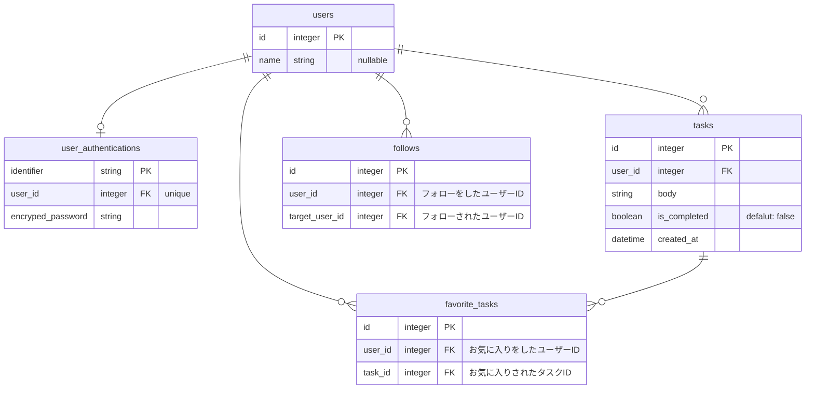
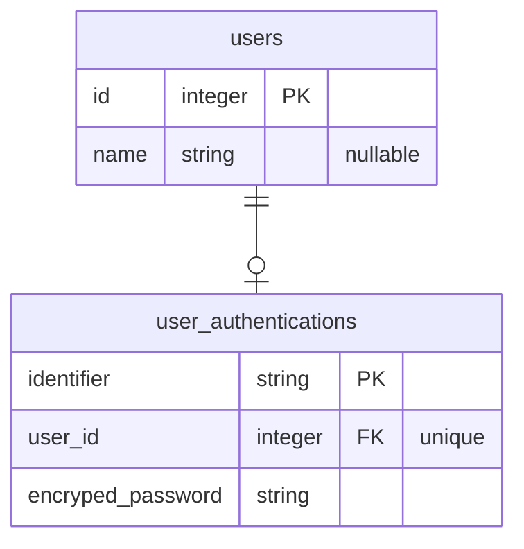

# インターン生入社前課題

本課題に取り組み、社員チェックが通れば実務に入ることができます。

# 目的

- 自己解決力を鍛える
- Web / Web アプリケーション開発の基礎を学ぶ

## 完成イメージ

※ この通りのUIにする必要はないです！

https://github.com/user-attachments/assets/ba56b2ec-2df2-44a3-aef0-b856956b6d90

## 技術スタック

### Vue

ユーザーインターフェースの構築のための JavaScript フレームワークで、本課題ではフロントエンドとして使用します。

Vue には二つの書き方 **`Options API`** **`Composition API`** が存在します！
本課題では前者の **`Options API`** という書き方で実装するようにお願いします！

また、ドキュメントを閲覧する際は左上の「API 選択」について `Options` を設定して閲覧してください！


**関連技術スタック**

- HTML
- CSS(SCSS/SASS)
- JavaScript(TypeScript)
- Vue Router

**参考資料**

- [はじめに - Vue.js](https://ja.vuejs.org/guide/introduction.html)
- [Vue 3 - 二つの API スタイル](https://ja.vuejs.org/guide/introduction.html#api-stlyes)
- [Vue 3 - ガイド](https://ja.vuejs.org/guide/introduction.html)

### Ruby on Rails

プログラミング言語 **Ruby** で実装された、MVC(Model / View / Controller) 設計アーキテクチャの Web フレームワークで、本課題においては Web サーバーサイドとして使用します。

**参考資料**

- [Rails を始めよう - Rails ガイド](https://railsguides.jp/getting_started.htm)
- [MVCモデルについて #プログラミング - Qiita](https://qiita.com/riku-shiru/items/2bed096e106e72e0b58a)

### MySQL

MySQL は、オープンソースのリレーショナルデータベース管理システムである。

**参考資料**

- [MySQL :: MySQL 8.0 リファレンスマニュアル](https://dev.mysql.com/doc/refman/8.0/ja/)


## セットアップ

> [!IMPORTANT]
> 必ず Fork をしてください。Fork のやり方がわからなければ下記記事を参考にしてください。
> - [リポジトリをフォークする](https://docs.github.com/ja/pull-requests/collaborating-with-pull-requests/working-with-forks/fork-a-repo)
>
> Git SSH 環境を整えてください。Git SSH 環境がなければ下記記事を参考にしてください。
> - [新しい SSH キーを生成する](https://docs.github.com/ja/authentication/connecting-to-github-with-ssh/generating-a-new-ssh-key-and-adding-it-to-the-ssh-agent)
> - [新しい SSH キーを追加する](https://docs.github.com/ja/authentication/connecting-to-github-with-ssh/adding-a-new-ssh-key-to-your-github-account)

```sh
git clone git@github.com:<owner-name>/pre-joining-assignment-for-intern.git ~/pre-joining-assignment-for-intern
cd ~/pre-joining-assignment-for-intern
/bin/bash setup.sh
```

- ページ URL: [http://localhost:5173/](http://localhost:5173/)

## コマンド一覧

```sh
# コンテナ起動（デーモン起動）
docker compose up -d

# ログ確認
docker compose logs

# コンテナ停止
docker compose stop

# コンテナ削除
docker compose down

---

# Rails コマンド各種

## DB Migration
docker compose run --rm backend sh -lc 'bundle exec rails db:migrate'

## DB Migration Status
docker compose run --rm backend sh -lc 'bundle exec rails db:migrate:status'
```

# 要件
タスク共有掲示板 Web アプリケーションを作成する。

## 全体

- このアプリでは認証情報を必要とする。つまり、ユーザー情報がない（サインインしない）と使用できない。
  - Rails の session 機能を使って認証情報があるかどうかを判断する。
- 認証情報がなければサインインページに遷移する
- 存在しないページにアクセスした場合は 404 ページを返す

## データベース スキーマ



## サインアップ

| URL or Endpoint | Path | 詳細 |
| --- | --- | -- |
| Vue Router ページ URL | `/sign_up` | サインアップページ |
| Rails エンドポイント | `POST /api/users` | 新規登録処理 |

- 本アプリでは次の認証情報を必要とする
  - ユーザー識別子（ `user_authentications.identifier` ）
    - 8文字以上、32文字以下で設定可能（それ以外は🙅🏻‍♂️）
    - 半角英字（ `a-z` | `A-Z` ）、半角数字（ `0-9` ）、アンダースコア（ `_` ）のみ使用可能
    - 他のユーザーと重複してユーザー識別子を登録できない（一意であること）
  - パスワード（ `` ）
    - 8文字以上、32文字以下で設定可能（それ以外は🙅🏻‍♂️）
    - 半角英字（ `a-z` | `A-Z` ）、半角数字（ `0-9` ）、一部記号（ `_` | `-` | `@` ）のみ使用可能
    - データベースには平文で保存するのではなく、ハッシュ化して安全に保存すること
- フォームにはユーザー識別子、パスワード、また入力ミス防止のため、パスワード確認用の入力欄を用意する
- パスワード入力欄はマスキングすること
- 「新規登録」ボタンを用意し、クリックして新規登録処理を走らせる
- 上記で掲示しているユーザー情報の条件に一つでも一致しない場合はエラーを発生させること
- 入力情報に問題がなければ `users` テーブルを作成し、`user_authentications` テーブルを作成する
  - `user_authentications.user_id` は作成した `users.user_id` とする
  - `user_authentications.identifier` は入力されたユーザー識別子を入れる
  - `user_authentications.encryped_password` は入力されたパスワードをハッシュ化して入れる
- エラーが発生した場合はブラウザで使用できる JavaScript のメソッド `window.alert` でエラー内容をユーザーに伝達すること
- 成功時はサインインページに遷移すること

## サインイン

| URL or Endpoint | Path | 詳細 |
| --- | --- | -- |
| Vue Router ページ URL | `/signin` | サインインページ |
| Rails エンドポイント | `POST /api/signin` | 認証処理 |

- サインイン時にはユーザー識別子とパスワードで認証をする
- パスワード入力欄はマスキングすること
- 入力されたユーザー識別子（ `user_authentications.identifier` ）とパスワード（ `user_authentications.encrypted_password` ）が存在すれば認証成功とする。
- 存在しない場合はエラーを発生されること。
- エラーが発生した場合はブラウザで使用できる JavaScript のメソッド `window.alert` でエラー内容をユーザーに伝達すること
- 成功時はトップページに遷移すること

## トップページ

| URL or Endpoint | Path | 詳細 |
| :-: | --- | -- |
| Vue Router ページ URL | `/` | トップページ |

- 画面上部（PCだと1/4、SPだと1/3のサイズ）にタスク作成フォームを置く。
- タスク作成フォームは sticky に
- タスク作成フォームの下に一覧をを置く。
- 一覧のタスク表示は 15 件までとする。それ以降は「さらに読み込む」を設置して追加読み込みをできるようにする。
- タスク作成フォームと一覧の間にナビゲーションバーを設置し、my タスク か みんなのタスク か フォローユーザーのタスクを選択して一覧表示したいタスクを選ぶ。
- みんなのタスクには自分以外のユーザーの全てのタスクを表示する。
- フォローユーザーのタスクはフォローしているユーザーのタスクだけ表示する。
- 完了 / 未完了のチェックボックスを設置して、表示する条件を付与する
- お気に入り機能

### タスク作成フォーム

| URL or Endpoint | Path | 詳細 |
| :-: | --- | -- |
| Rails エンドポイント | `POST /api/tasks` | タスク作成処理 |

- タスク内容用の入力欄を用意する
- 入力欄が空の状態では送信できない
- `tasks` レコードを作成する
  - `tasks.user_id` には現在サインイン中の `user_id` を入れる
  - `tasks.body` にはタスク内容用の入力欄の値を入れる
  - `tasks.is_completed` には初期値に `false` を入れる（ MySQL 上で初期値は `false` にするよう設定する）
- `tasks` レコード作成時にリクエストされたタスク内容が空（null or 空文字）の場合はエラーを発生させる
- エラーが発生した場合は `window.alert` でユーザーに通達する

### タスク編集フォーム

| URL or Endpoint | Path | 詳細 |
| :-: | --- | -- |
| Rails エンドポイント | `PATCH /api/tasks/:task_id` | タスク更新処理 |

- サインイン中のユーザー自身が作成したタスクの内容 （ `tasks.body` ）を編集することができる
- 編集された `tasks.body` と、編集された時刻を `tasks.edited_at` に入れてレコードを更新する
- サインイン中のユーザー以外が作成したタスクは編集できない

### タスク完了化 / 未完了化

| URL or Endpoint | Path | 詳細 |
| :-: | --- | -- |
| Rails エンドポイント | `PUT /api/tasks/:task_id/complete` | タスク完了化処理 |
| 〃 | `PUT /api/tasks/:task_id/incomplete` | タスク未完了化処理 |

- サインイン中のユーザー自身のタスクを完了 / 未完了にすることができる
- `tasks.is_completed` を完了時は `true` とし、未完了時は `false` とする。
- サインイン中のユーザー以外のタスクを完了 / 未完了にすることはできない

### タスク一覧表示

| URL or Endpoint | Path | 詳細 |
| :-: | --- | -- |
| Rails エンドポイント | `GET /api/tasks` | タスク一覧取得処理 |

- 全体で共通の要件↓
  - 初回読み込み時はタスクは最大 15 件まで表示する
  - 対象の条件のタスクが 16 件以上存在する場合は「再読み込み」して追加でタスク一覧を読み込めること
    - この時追加で読み込まれるタスク数も 15 件までとする
  - 以降も対象のタスクが存在する場合は上記の条件で「再読み込み」できる形とする
  - **N + 1問題** を起こさずにタスクを一覧読み込みすること
  - **XSS** セキュリティリスクが生じないようにすること。
- [My タスク」「みんなのタスク」「お気に入りタスク」「フォロータスク」ごとに一覧表示するタスクを切り替えられるようにする
  - My タスク: 現在サインイン中のユーザーが作成したタスクを一覧表示する
  - みんなのタスク: 現在サインイン中のユーザー **以外** の全てのタスクを一覧表示する
  - お気に入りタスク: お気に入りしたタスクを一覧表示する（お気に入り機能に関しては後述）
  - フォロータスク: フォローしたユーザーのタスクを一覧表示する（フォロー機能に関しては後述）
- クエリパラメータを使って表示したいタスクの種類（[My タスク」「みんなのタスク」「お気に入りタスク」「フォロータスク」）を制御する
- クエリパラメータを使ってページング処理（「再読み込み」）を実施する

### タスクお気に入り

| URL or Endpoint | Path | 詳細 |
| :-: | --- | -- |
| Rails エンドポイント | `POST /api/tasks/:task_id/favorite` | タスク一覧取得処理 |

- 他のユーザーが作成したタスクを「お気に入り」することができる。
- 現在サインイン中のユーザーは自身のタスクを「お気に入り」することができない。

### ユーザーをフォロー / アンフォロー

| URL or Endpoint | Path | 詳細 |
| :-: | --- | -- |
| Rails エンドポイント | `PUT /api/users/follow/:target_user_id` | ユーザーフォロー |
| 〃 | `DELETE /api/users/follow/:target_user_id` | ユーザーアンフォロー |

- 他のユーザーをフォローすることができる
- すでにフォロー中のユーザーにもう一度フォローすることはできない
- サインイン中のユーザー自身をフォローすることはできない
- フォロー中の他のユーザーをアンフォローすることができる
- フォローしていない他のユーザーをアンフォローすることができない

<details>
  <summary><h3>👹 裏メニュー</h3></summary>
  🚜 工事中 🚜
</details>

# Step 0: ⚙️ 環境構築

実装にあたり、環境構築をする必要があります。
以下のステップに沿って開発環境を整備してください。

### 1. リポジトリの fork

1. [本リポジトリ](https://github.com/matcher-inc/pre-joining-assignment-for-intern) にアクセス
2. 右上の Fork をクリック
3. 自身の GitHub アカウントにリポジトリを作成

### 2. リポジトリの clone

<details>
  <summary><h4>SSHを設定済みでない場合</h4></summary>

  1. お好きなターミナルアプリを開く
  2. `mkdir -p ~/.ssh && cd ~/.ssh` を実行
  3. `ssh-keygen -t ed25519 -C "your_email@example.com"` を実行（メールアドレスは適宜変更してください）
  4. `> Enter a file in which to save the key ...` と出力されたら `github` と入力
  5. コマンド実行が完了するまで Enter を入力
  6. 以下をペースト

```sh
cat <<EOS >> ~/.ssh/config
Host github.com
  AddKeysToAgent yes
  UseKeyChain yes
  IdentityFile ~/.ssh/github

EOS
```
</details>


1. Fork したリポジトリにアクセス
2. Code をクリックし、SSH のコマンドをコピー
3. お好きなターミナルアプリを開く
4. `cd ~` でホームディレクトリに移動
5. `git clone ` まで入力し、コピーしたコマンドをペースト

### 3. セットアップコマンドの実行

1. `cd ~/pre-joining-assignment-for-intern` を実行
2. `/bin/bash setup.sh` を実行

# Step 1: ✍️ サインアップ機能

## 要件

ユーザーとそれに紐づく認証データを作成する

### データベース

- `users`: ユーザー情報
  - `id`: 主キー
  - `name`: ユーザー名
- `user_authentications`: 認証情報
  - `identifier`: 認証のための `user_authentications` テーブル上で一意な識別子
  - `user_id`: 紐づく `users` レコード
  - `encryped_password`: アカウントの持ち主であることを証明するハッシュ化された認証パスワード、**平文で保存しないこと**



### Rails

#### Model

#### Controller

### Vue

### 参考資料
