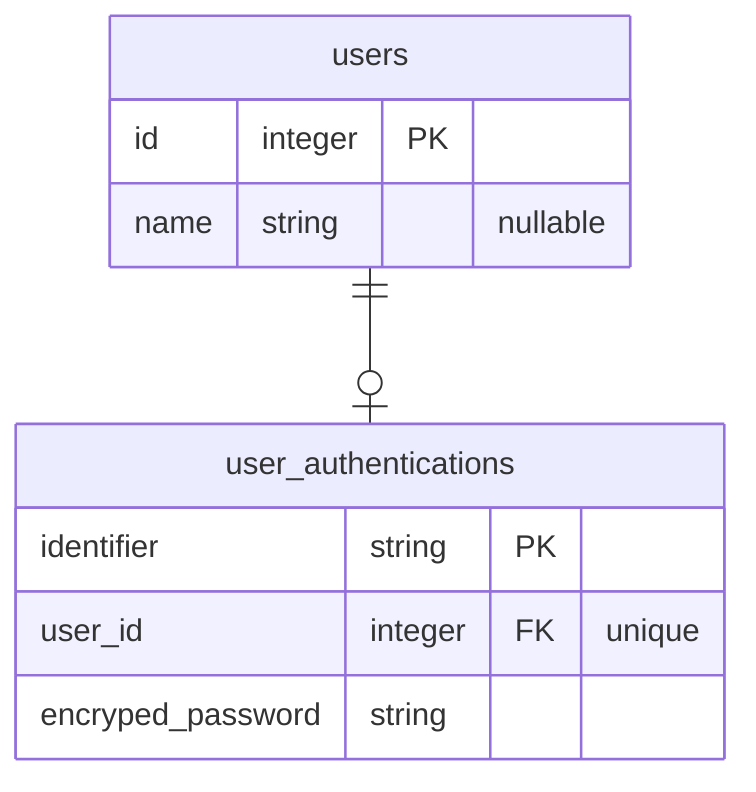

# Step 1: ✍️ サインアップ機能

## 要件

ユーザーとそれに紐づく認証データを作成する

### データベース

- `users`: ユーザー情報
  - `id`: 主キー
  - `name`: ユーザー名
- `user_authentications`: 認証情報
  - `identifier`: 認証のための `user_authentications` テーブル上で一意な識別子
  - `user_id`: 紐づく `users` レコード
  - `encryped_password`: アカウントの持ち主であることを証明するハッシュ化された認証パスワード、**平文で保存しないこと**

### Rails

#### Model

#### Controller

### Vue

### 参考資料
