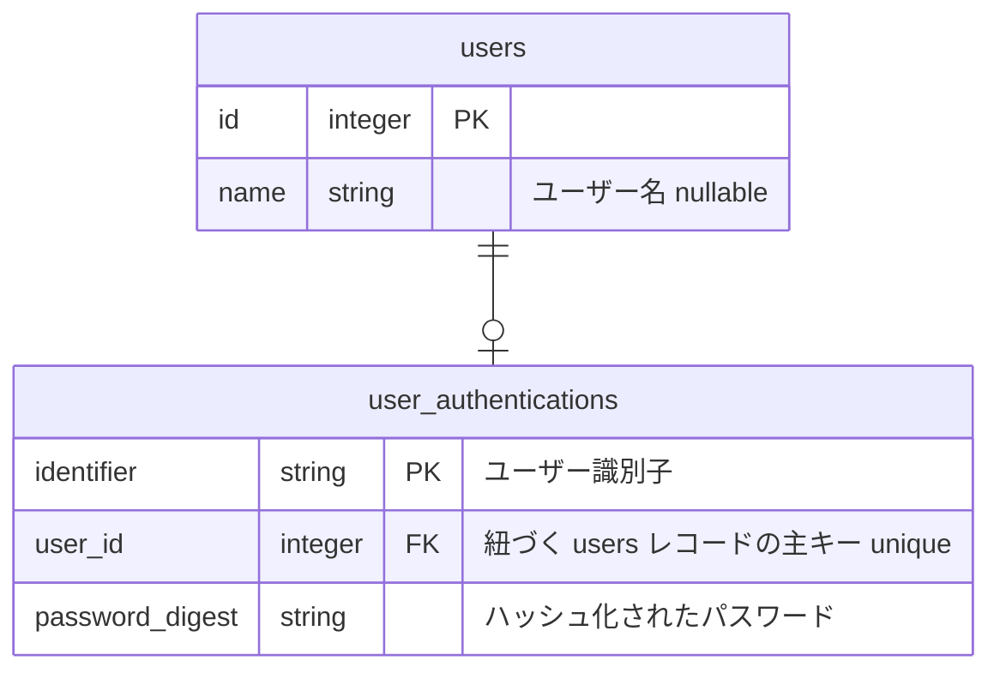

# Step 1: ✍️ サインアップ機能

## 要件

サインアップページを作成し、ユーザーとそれに紐づく認証データを作成する処理機構を実装する

### 詳細

#### Rails

- `routes.rb` に `POST /api/users` のエンドポイントを定義する
- コントローラー名は `UsersController` とする
- `users` レコードと `user_authentications` レコードを作成する
  - `users` レコードの作成と `user_authentications` の作成は一つの **トランザクション** にする
  - `user_authentications.password_digest` に保存するパスワードは **平文にせずハッシュ化** する

#### Vue

- Vue Router に `/sign_up` のルーティングを追加する
- ユーザー名、ユーザー識別子、パスワード、パスワード確認用のフォーム、フォーム送信ボタンを用意する
  - パスワード入力欄はマスキングすること
- エラーが発生した場合は `window.alert` 関数を使ってエラー内容をユーザーに知らせること
- 成功時は `/sign_in` に遷移すること

### エラーハンドリング

- ユーザー識別子が期待していない値でリクエストされた場合は HTTP ステータス 422 を返す
- パスワードが期待していない値でリクエストされた場合は HTTP 422 を返す

#### データベース

- `users`: ユーザー情報
  - `id`: 主キー
  - `name`: ユーザー名
- `user_authentications`: 認証情報
  - `identifier`: 認証のための `user_authentications` テーブル上で一意な識別子
    - 8文字以上、32文字以下で設定可能（それ以外は🙅🏻‍♂️）
    - 半角英字（ `a-z` | `A-Z` ）、半角数字（ `0-9` ）、アンダースコア（ `_` ）のみ使用可能
    - 他のユーザーと重複してユーザー識別子を登録できない（一意であること）
  - `user_id`: 紐づく `users` レコード
  - `password_digest`: アカウントの持ち主であることを証明するハッシュ化された認証パスワード
    - 8文字以上、32文字以下で設定可能（それ以外は🙅🏻‍♂️）
    - 半角英字（ `a-z` | `A-Z` ）、半角数字（ `0-9` ）、アンダースコア（ `_` | `-` | `@` ）のみ使用可能
    - 値を平文で保存するのではなく、ハッシュ化して安全に保存すること

**📚 参考資料**

- [🔗 Active Record の関連付け - Railsガイド](https://railsguides.jp/association_basics.html)
  - この資料では `has_many` や `belongs_to` などのモデルの関連付けをを学べます！
- [🔗 レイアウトとレンダリング - Railsガイド](https://railsguides.jp/v8.1/layouts_and_rendering.html)
  - [🔗 2.2.13 renderのオプション](https://railsguides.jp/v8.1/layouts_and_rendering.html#render%E3%81%AE%E3%82%AA%E3%83%97%E3%82%B7%E3%83%A7%E3%83%B3)セクションで特定のステータスコードの返し方を学べます！
- [🔗 ActiveRecordのトランザクションを理解する #Ruby - Qiita](https://qiita.com/mtoyopet/items/67d1cff3df00aa651cb7)
