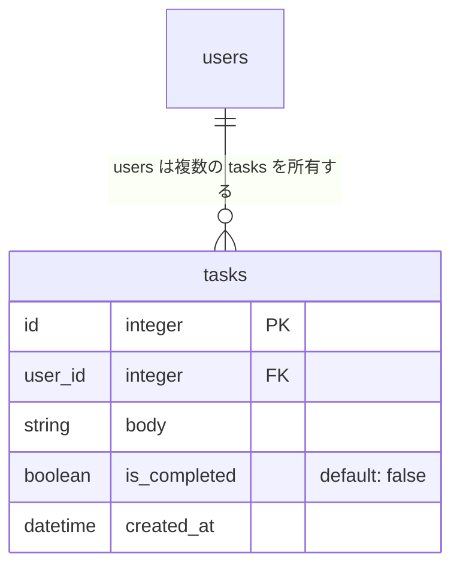

# Step 3: 📖 タスク作成機能

## 要件

タスク作成フォームを実装し、新しいタスクを DB に保存する
また、サインアウトしている場合はサインインページに遷移する機構も作成する

## サンプルビデオ

準備中 🚜

## 詳細

### Rails

- 次のエンドポイントを作成する

| HTTP メソッド | パス         | 用途                   |
| ------------- | ------------ | ---------------------- |
| `POST`        | `/api/tasks` | 新しいタスクを作成する |

- `POST /api/tasks` のリクエストでは、`task.body` としてタスク内容を受け取る
- コントローラー名は `TasksController` とする
- アクション名は `create` とする
- `create` では Rails session に保存されているユーザー識別子から、サインイン中のユーザーを取得する
  - リクエストから `user_id` を受け取ったり、指定したりしてはいけない
- サインイン中のユーザーに紐づく `tasks` レコードを一つ作成する
  - `user_id` にはサインイン中のユーザーの ID を保存する
  - `body` には送信されたタスク内容を保存する
  - `is_completed` は初期値として `false` を保存する

### Vue

- `frontend/app/src/pages` に `Root.vue` を作成
  - step2 で実装した `GET /api/sessions/new` を、`mounted` を使ってページ読み込み時に呼び出し、サインイン状態を確認する
    - サインアウトしていれば `/sign_in` にリダイレクトとする
    - 認証状態の確認が完了するまで、子ページを表示しないようにする
- `frontend/app/src/pages` に `home` ディレクトリを作成し、`index.vue` を用意する
  - タスク内容の入力欄と送信ボタンを持つタスク作成フォームを用意する
  - 空の状態では送信できないようにする
  - フォーム送信時に `POST /api/tasks` を呼び出す
  - 作成に成功したら入力欄を空にする
  - 作成に失敗したら `window.alert` 関数でエラー内容をユーザーに知らせる
- API の呼び出し処理は、既存の repository 層にタスク作成用の処理を追加して行う

### エラーハンドリング

- タスク作成時にサインインしていなければ HTTP ステータス 401 を返す
- `body` が空文字または `null` で送られてきた場合は HTTP ステータス 422 を返す
- エラー時は、次のようにエラー内容を JSON で返す

```json
{ "error": "エラー内容" }
```

### データベース

- `tasks`: タスク
  - `id`: 主キー
  - `user_id`: 紐づく `users` レコードの主キー
  - `body`: タスク内容
  - `is_completed`: タスクが完了しているかどうか
    - 初期値は `false` とする
  - `created_at`: 作成時間タイムスタンプ



**📚 参考資料**

- [🔗 Active Record の関連付け - Railsガイド](https://railsguides.jp/association_basics.html)
  - `users` と `tasks` の関連付けを学べます！
- [🔗 Active Record バリデーション - Railsガイド](https://railsguides.jp/active_record_validations.html)
  - タスク内容が空の場合に保存を失敗させる方法を学べます！
- [🔗 フォーム入力バインディング - Vue.js](https://ja.vuejs.org/guide/essentials/forms.html)
  - `v-model` を使ってフォームの入力値を扱う方法を学べます！
