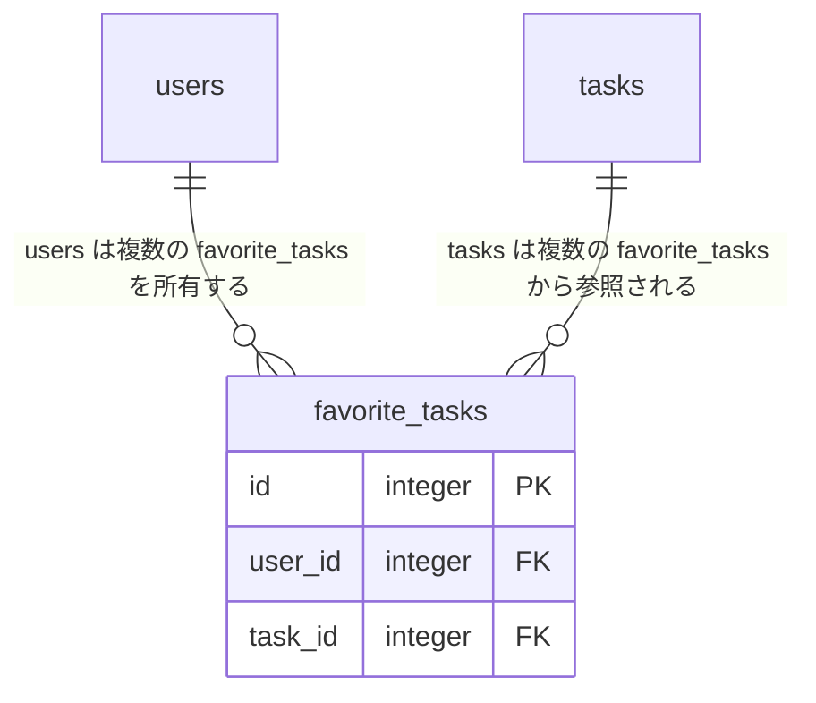

# Step 6: 🌟 タスクお気に入り機能

## 要件

他のユーザーが作成したタスクをお気に入り登録・解除できるようにする

また、お気に入り登録したタスクを一覧表示できるようにする

## サンプルビデオ

<https://github.com/user-attachments/assets/5c66ed9e-8fca-4c84-a53f-3f99c04269b3>

## 詳細

### Rails

- 次のエンドポイントを作成する

| HTTP メソッド | パス                           | アクション名 | 用途                         |
| ------------- | ------------------------------ | ------------ | ---------------------------- |
| `POST`        | `/api/tasks/:task_id/favorite` | `create`     | タスクをお気に入り登録する   |
| `DELETE`      | `/api/tasks/:task_id/favorite` | `destroy`    | タスクのお気に入りを解除する |

- コントローラー名は `FavoriteTasksController` とする
- サインイン中のユーザーと対象タスクに紐づく `favorite_tasks` レコードを作成・削除する
- リクエストから `user_id` を受け取ったり、指定したりしてはいけない
- 自分が作成したタスクはお気に入り登録できない
- 同じユーザーが同じタスクを重複してお気に入り登録できない
- 成功時は以下の形式で更新後のお気に入り状態を返す
  - 登録時は HTTP ステータス 201 を返す
  - 解除時は HTTP ステータス 200 を返す

```json
{
  "task": {
    "id": 1,
    "is_favorited": true
  }
}
```

#### お気に入りタスク一覧

- Step 4 で作成した `GET /api/tasks` のクエリパラメーター `type` に `favorites` を追加する
- `type=favorites` では、サインイン中のユーザーがお気に入り登録したタスクを取得する
- タスク自体の作成日時と ID の新しい順に並べる
- Step 4・5 の `completion`、`page`、15件ずつの追加読み込みを併用できるようにする
- タスク一覧の各要素に `is_favorited` を追加する
- お気に入り状態の取得時に **N + 1問題** が発生しないようにする

```json
{
  "id": 1,
  "body": "タスク内容",
  "is_completed": false,
  "is_favorited": true,
  "created_at": "2026-07-24T10:00:00.000+09:00",
  "user": {
    "id": 2,
    "name": "ユーザー名"
  }
}
```

### Vue

- 一覧の種類に「お気に入りタスク」を追加する
- みんなのタスクとお気に入りタスクに「お気に入り」または「お気に入り解除」ボタンを表示する
- My タスクにはお気に入りボタンを表示しない
- API を呼び出している間は、対象タスクのボタンだけを無効にする
- 更新に成功したら一覧全体を再取得せず、対象タスクの `is_favorited` を更新する
- お気に入りタスク一覧でお気に入りを解除した場合は、対象を一覧から外した後、1ページ目から再取得する
- API の呼び出しに失敗した場合は変更前の状態に戻し、`window.alert` 関数でエラー内容をユーザーに知らせる
- API の呼び出し処理は既存の repository 層に追加する

### エラーハンドリング

- サインインしていない場合は HTTP ステータス 401 を返す
- 対象のタスクが存在しない場合は HTTP ステータス 404 を返す
- 登録されていないお気に入りを解除しようとした場合は HTTP ステータス 404 を返す
- 自分のタスクまたは登録済みのタスクをお気に入り登録しようとした場合は HTTP ステータス 422 を返す
- `type` が `my`、`others`、`favorites` 以外の場合は HTTP ステータス 400 を返す
- エラー時は `{ "error": "エラー内容" }` を返す

### データベース

- `favorite_tasks`: お気に入り情報
  - `id`: 主キー
  - `user_id`: お気に入り登録したユーザー
  - `task_id`: お気に入り登録されたタスク
  - `user_id` と `task_id` の組み合わせは一意とする
  - 紐づくユーザーまたはタスクが削除された場合は、お気に入り情報も削除する



## 動作確認

- 他のユーザーのタスクをお気に入り登録・解除できる
- 自分のタスクや同じタスクを重複してお気に入り登録できない
- お気に入りタスク一覧に登録済みのタスクだけが表示される
- お気に入り状態が各タスクのボタンに反映される
- お気に入り一覧から解除したタスクが一覧から外れる
- 完了状態の絞り込みと15件ずつの追加読み込みを併用できる

**📚 参考資料**

- [🔗 Active Record の関連付け - Railsガイド](https://railsguides.jp/association_basics.html)
  - `has_many :through` や `belongs_to` を使ったモデル間の関連付けを学べます！
- [🔗 Active Record マイグレーション - Railsガイド](https://railsguides.jp/active_record_migrations.html)
  - 外部キーや一意インデックスを持つテーブルの作成方法を学べます！
- [🔗 イベントハンドリング - Vue.js](https://ja.vuejs.org/guide/essentials/event-handling.html)
  - ボタン操作からAPI呼び出しを行う方法を学べます！
